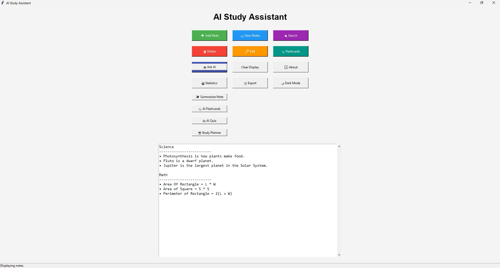
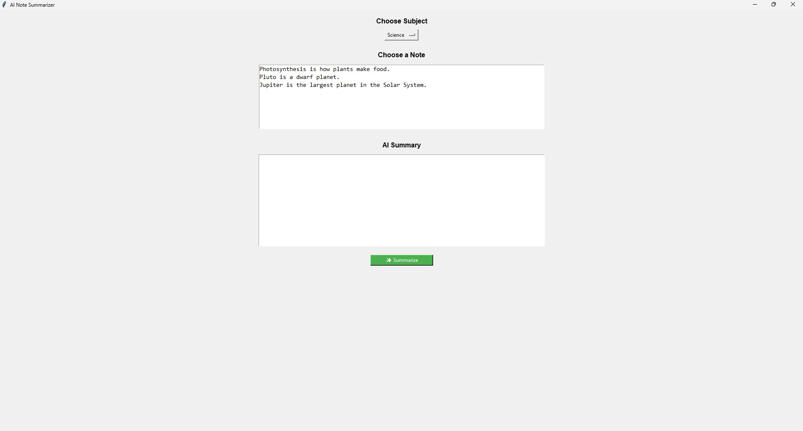
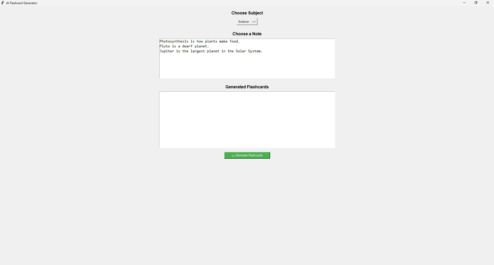
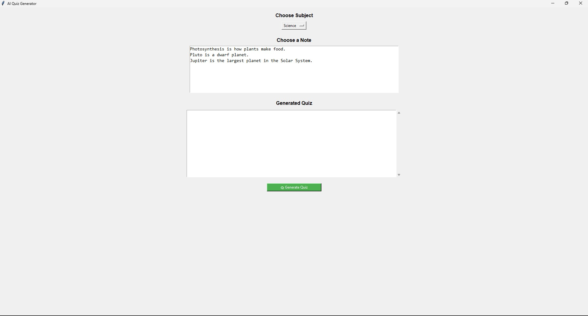
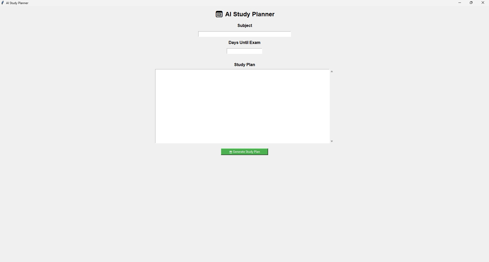

# AI Study Assistant

An AI-powered desktop study application built with Python and Tkinter.

## Features

- Add, Edit, Delete Notes
- Search Notes
- Flashcards
- Practice Quiz
- AI Chat
- AI Summarizer
- AI Flashcard Generator
- AI Quiz Generator
- AI Study Planner
- Export Notes
- Statistics
- Dark Mode

## Technologies

- Python
- Tkinter
- JSON
- Groq API

## Installation

pip install -r requirements.txt

## Run

python gui.py

# Screenshots

## Main Window

## Ask AI

## AI Summarizer

## AI Flashcards

## AI Quiz Generator

## AI Study Planner

